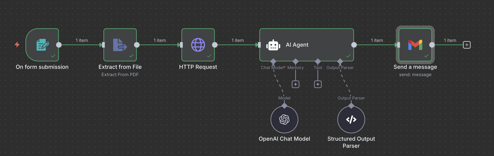

# 🧠 Resume Refiner AI Agent (n8n Workflow)

## I. 📄 Overview

The Resume Refiner AI Agent is an automated, intelligent workflow built on the [n8n](https://n8n.io/)  automation platform. It accepts a user-submitted resume and a job posting link, parses the contents, and uses OpenAI to generate targeted, actionable suggestions to improve the resume for that specific job. The final suggestions are structured into bullet points categorized under "Actionable Suggestions to Improve the Resume" and "Keywords/Phrases from Job Description", and emailed directly to the user in a clean, professional format.

This project reflects a modern approach to job application personalization by leveraging LLMs, automation tools, and email delivery to help users increase their chances of standing out in competitive job markets. It’s designed with aspiring professionals and career coaches in mind, offering scalable, AI-driven insights in a matter of seconds.

---

## II. AI Agent Flow Diagram

---

## III. 🛠️ Building the Agent

The idea for the agent stemmed from a real-world problem: job seekers often fail to tailor their resumes effectively to each job, missing out on vital keywords and not aligning their experience with what the employer is looking for. I wanted to build an automated assistant that bridges this gap with minimal user input—just a resume and a job link.

## Design Approach

I chose n8n for its low-code flexibility and seamless API integrations to bring this idea to life, . The workflow begins by collecting user inputs via a form or webhook. The job description is scraped from the provided link using HTTP request and HTML extract nodes. Both the resume and job description are then passed to the OpenAI node with a carefully crafted prompt that requests structured feedback in JSON format.

I used the Structured Output Parser with a strict JSON schema, ensuring the agent always returned well-formed, parsable data to handle the OpenAI response,. The AI's output was then parsed and transformed into an HTML-formatted message to be sent via email. Special care was taken to format the suggestions into cleanly separated sections with proper spacing, headings, and bullet points.

## Integration Challenges

One of the biggest technical hurdles was ensuring consistent formatting in the AI's output. GPT-based models are excellent at language but occasionally struggle with rigid JSON structures. I iteratively tested prompt designs with real examples and implemented schema validation on the parser to mitigate this. I significantly improved the consistency of the results by being explicit in the prompt. 

Another challenge was sending well-organized emails. Initially, the suggestions appeared jumbled in the email body due to lack of spacing and formatting. I resolved this by hand-crafting the HTML structure with proper `<h2>` headings and `<ul><li>` lists, making the suggestions easily scannable and visually organized for the recipient.

---

## IV. 🛠️ Troubleshooting

Throughout development, I encountered several issues ranging from minor logic bugs to larger integration breakdowns.

- **Blank AI Output:** In earlier iterations, the AI agent returned no data. This turned out to be a result of an improperly passed or empty prompt. I added validation checks to ensure prompt fields were never left blank before reaching the AI node.

- **Malformed JSON:** Occasionally, GPT would return extra text or improperly formatted JSON. To fix this, I updated the prompt to explicitly warn against adding any explanatory text, and added fallback logic in the workflow to detect and retry malformed responses.

- **Disorganized Email Content:** Early versions of the email lacked readability. After testing multiple email clients, I adopted clean HTML with heading tags and bullet lists to separate suggestions clearly. Testing across different devices helped me refine the design for better user experience.

---

## V. 🚀 Optimization

IV. Optimization
While the current version works reliably, there are many exciting avenues for future improvement:

1. **Adding Resume Scoring System :** 
A scoring module can be added to quantify how well a resume aligns with a job description. This would give users a numerical benchmark along with improvement suggestions. This could be implemented by adding a scoring key to the OpenAI prompt (e.g., 1–100 scale) and weighting sections like Skills Match, Role Alignment, and Keyword Density.

2. **File Upload Support (PDF/Docx Parsing) :**
Currently, the agent assumes resumes are submitted as plain text. Adding a file upload input that parses .pdf or .docx files using a parser like Tika or PDF.js would significantly improve user experience and broaden usability.

3. **Job Posting Extraction Enhancements :**
Job pages from different websites vary greatly. While the current workflow extracts the job description from basic HTML tags, I could enhance accuracy using a dedicated scraping service like Diffbot, or by training a simple NLP model to extract relevant job info more intelligently.

4. **User Dashboard with History :**
In future versions, I envision building a small front-end dashboard using Next.js or React, backed by Supabase or Firebase, to allow users to track previously refined resumes, job applications, and improvement history.

5. **Multi-language Support :**
I could implement multilingual support by allowing users to select their preferred language to increase accessibility. This could be done by dynamically translating both input and AI responses using tools like DeepL or Google Translate APIs.
---

This project combines automation, AI, and UX principles into a meaningful tool for job seekers. I built it not just as a technical showcase but as a reflection of how AI can be used to solve real-world problems in a practical, accessible way.
